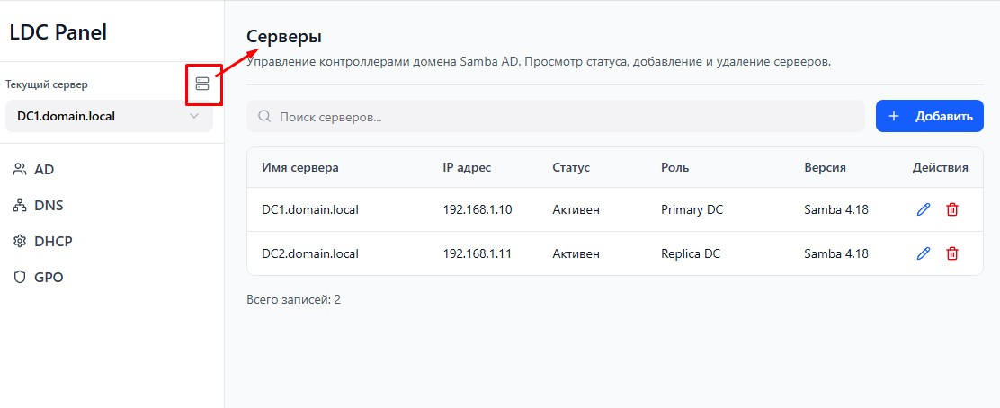

# LDC Panel

Веб-интерфейс для управления контроллерами домена Active Directory на Samba.



## Возможности

- Пользователи и компьютеры Active Directory
- DNS-записи
- DHCP-сервер
- Просмотр групповых политик (GPO)

## Установка

```bash
sudo python3 install.py
```

## Запуск

```bash
python3 run.py
```

### Режим разработки

С автоматической перезагрузкой при изменении файлов:

```bash
python3 run.py --dev
```

## Конфигурация

Настройки сервера хранятся в `config.yaml`:

```yaml
# Сетевой интерфейс: 127.0.0.1 (локально) или 0.0.0.0 (из сети)
host: "127.0.0.1"
port: 8000
```

## Интерфейс

http://localhost:8000
